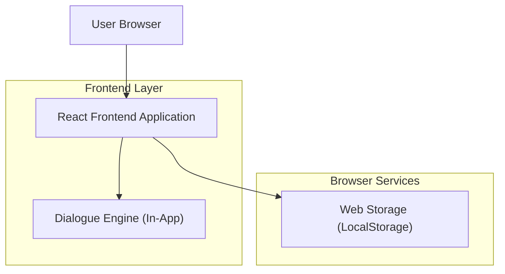
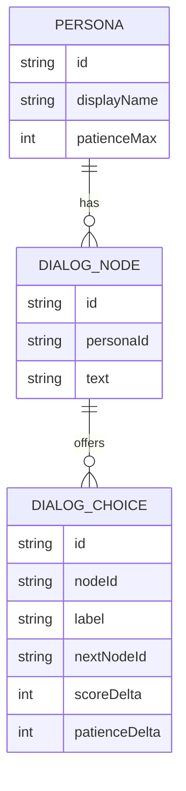

## 1.Architecture design

## 2.Technology Description
- Frontend: React@18 + TypeScript + vite
- Styling: tailwindcss@3 (opsiyonel)
- Backend: None

## 3.Route definitions
| Route | Purpose |
|---|---|
| / | Ana sayfa (başlat, kurallar, high score özeti) |
| /game | Oyun (sohbet, 20sn timeout, sabır, skor) |
| /scores | High score görüntüleme ve sıfırlama |

## 6.Data model(if applicable)
### 6.1 Data model definition
Oyun state’i istemci tarafında tutulur; high score LocalStorage’da saklanır.

### 6.2 Data Definition Language
Veritabanı yok (DDL uygulanmaz). LocalStorage anahtarları:
- `tps_high_score`: number
- `tps_settings` (opsiyonel): `{ soundEnabled: boolean }`